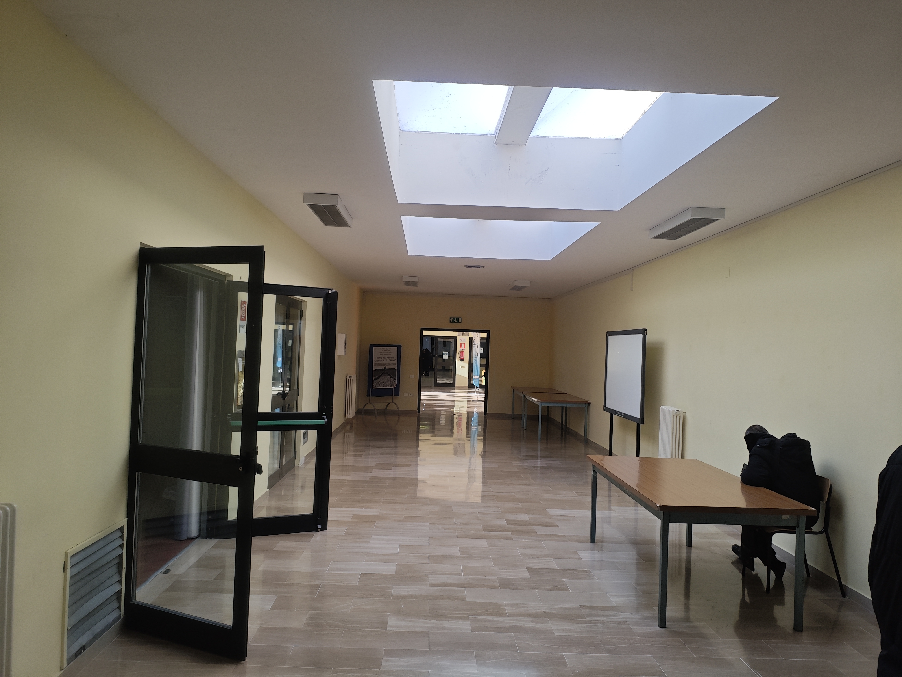
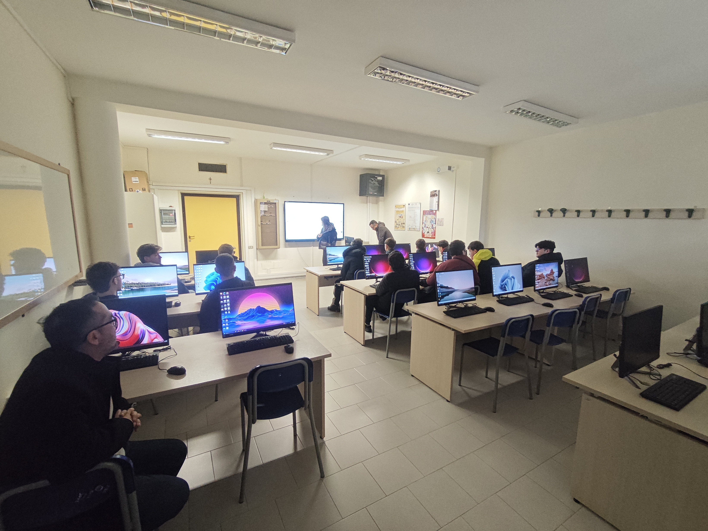

# PRESENTACIÓN ERASMUS-VET 25-26
## 🌍 TURI (ISS PERTINI ANELLI)

---

### DÍA 1: Llegada al instituto ISS Pertini Anelli Pinto

  
  

---

### Clase de informática - Prof. Vito Montanaro

  <button class="nav-btn prev" onclick="moveSlider(-1, 'slider1')">❮</button>
  
  

    
    
    
    
  

  <button class="nav-btn next" onclick="moveSlider(1, 'slider1')">❯</button>

---

  <h1>¡Gracias por su atención!</h1>
  
Erasmus+ 2025-2026

